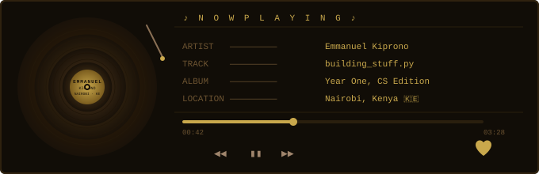

<div align="center">


```
  ███████╗███╗   ███╗███╗   ███╗ █████╗ ███╗   ██╗██╗   ██╗███████╗██╗
  ██╔════╝████╗ ████║████╗ ████║██╔══██╗████╗  ██║██║   ██║██╔════╝██║
  █████╗  ██╔████╔██║██╔████╔██║███████║██╔██╗ ██║██║   ██║█████╗  ██║
  ██╔══╝  ██║╚██╔╝██║██║╚██╔╝██║██╔══██║██║╚██╗██║██║   ██║██╔══╝  ██║
  ███████╗██║ ╚═╝ ██║██║ ╚═╝ ██║██║  ██║██║ ╚████║╚██████╔╝███████╗███████╗
  ╚══════╝╚═╝     ╚═╝╚═╝     ╚═╝╚═╝  ╚═╝╚═╝  ╚═══╝ ╚═════╝ ╚══════╝╚══════╝
                                                          K E M B O I
```


</div>

---

<div align="center">
  
</div>

---

## ◄ SIDE A — WHO I AM

```
  ░░░░░░░░░░░░░░░░░░░░░░░░░░░░░░░░░░░░░░░░░░░░░░░░░░░░░░

  CS student in Nairobi. Got into tech because I like
  solving problems — not because someone said it was
  the future.

  I write Python. I build web apps and platforms that
  are meant to be used, not just deployed and forgotten.

  When I'm not at a terminal, I'm deep in music.
  Not background noise — the other half of how I
  think, work, and move through the world.

  ░░░░░░░░░░░░░░░░░░░░░░░░░░░░░░░░░░░░░░░░░░░░░░░░░░░░░░
```

---

## ► SIDE B — THE STACK

<div align="center">


</div>

```
  ░░░░░░░░░░░░░░░░░░░░░░░░░░░░░░░░░░░░░░░░░░░░░░░░░░░░░░

  Python is home base. Django and Flask for the web.
  HTML/CSS when the frontend needs to not embarrass me.
  JavaScript only when I absolutely have to.
  SQL when the data has something to say.
  Git because breaking things is fine — losing them isn't.

  ░░░░░░░░░░░░░░░░░░░░░░░░░░░░░░░░░░░░░░░░░░░░░░░░░░░░░░

  PYTHON      ████████████████████░░░░  55%   home base
  HTML/CSS    ████████░░░░░░░░░░░░░░░░  20%   front of the front
  JAVASCRIPT  ██████░░░░░░░░░░░░░░░░░░  15%   when I have to
  SQL         ███░░░░░░░░░░░░░░░░░░░░░   7%   databases talk
  OTHER       █░░░░░░░░░░░░░░░░░░░░░░░   3%   misc
```

---

## ▣ GITHUB

<div align="center">


</div>

---

## ♫ THE RECORD CRATE

```
  ┌──────────────────────────────────────────────────────┐
  │                                                      │
  │   Music isn't what I listen to.                      │
  │   It's what I think in.                              │
  │                                                      │
  │   Different frequencies for different states:        │
  │                                                      │
  │   [ debugging  ]  ──────────  Lo-fi / Jazz           │
  │   [ building   ]  ──────────  Afrobeats / Gengetone  │
  │   [ thinking   ]  ──────────  Neo-soul / R&B         │
  │   [ 2 AM ideas ]  ──────────  anything, loud         │
  │                                                      │
  └──────────────────────────────────────────────────────┘
```

---

## ◈ LINER NOTES

```
  ░ ANIME         One Punch Man > Goku.  Not a debate.
  ░ FUEL          Kenyan tea.  Always.
  ░ BEST IDEAS    Come at 2 AM.  Ship in the morning.
  ░ HARDEST PART  Naming variables.  Genuinely.
  ░ PHILOSOPHY    Build it right or build it again.
```

---

<div align="center">

[](https://www.linkedin.com/in/emmanuel-kiprono-14a800389)
[](https://github.com/emmanuelkiprono)

```
  ─────────────────────────────────────────────────────
    ♪  thanks for listening  ·  nairobi, kenya 🇰🇪  ♪
  ─────────────────────────────────────────────────────
```


</div>
